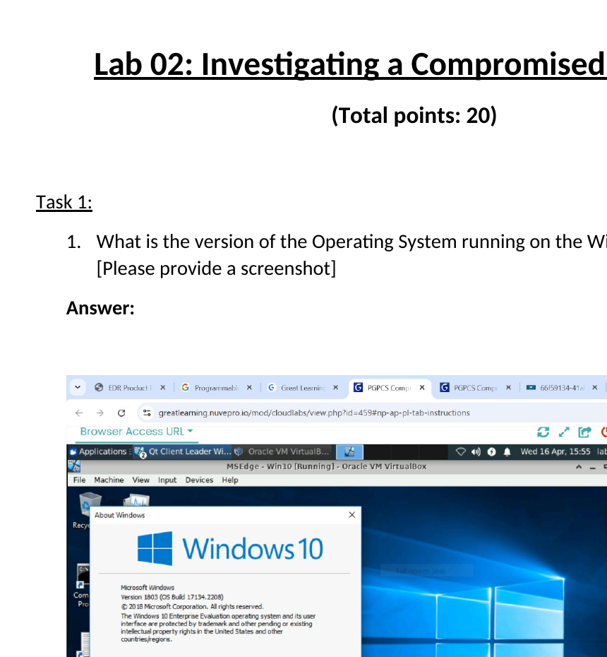
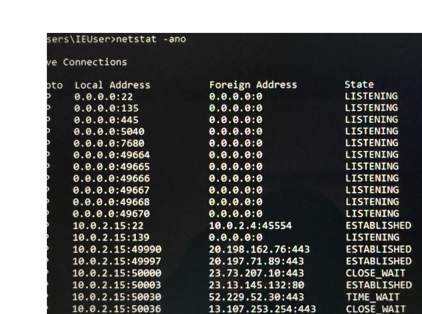
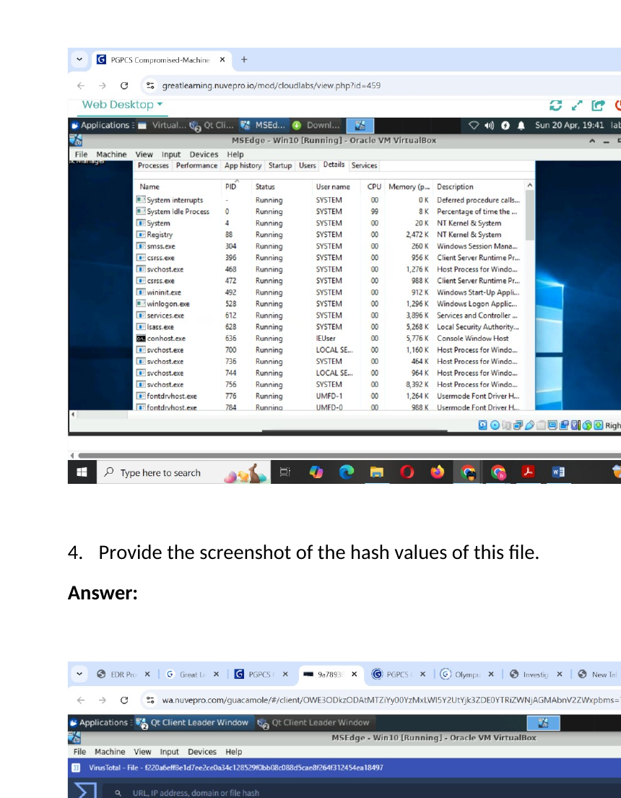
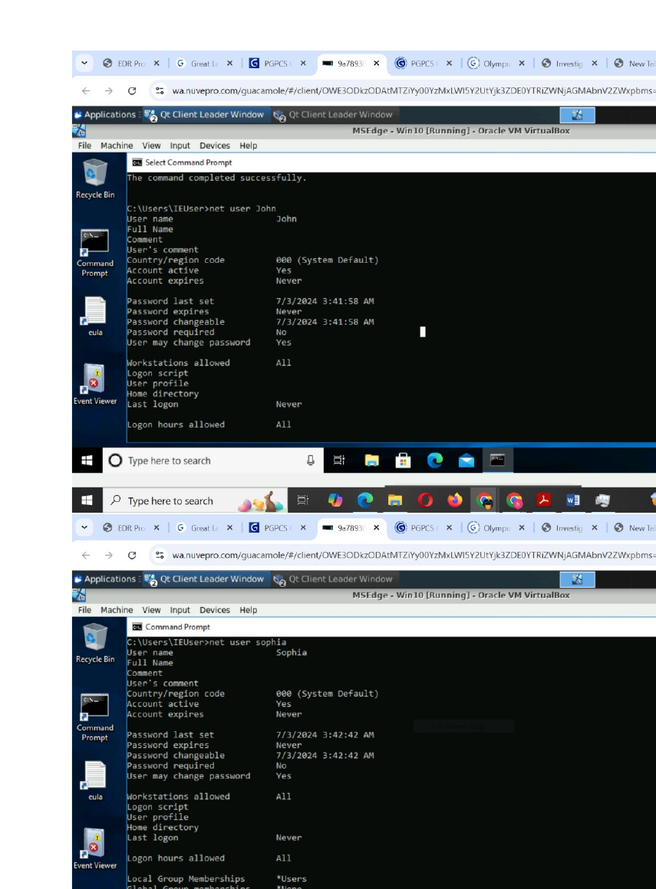
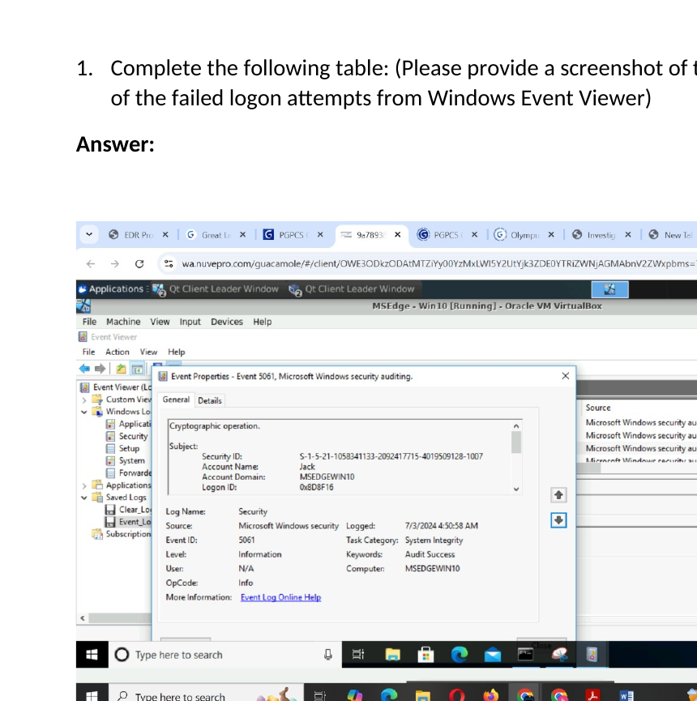
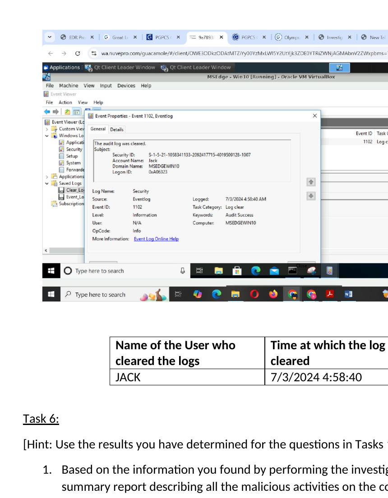
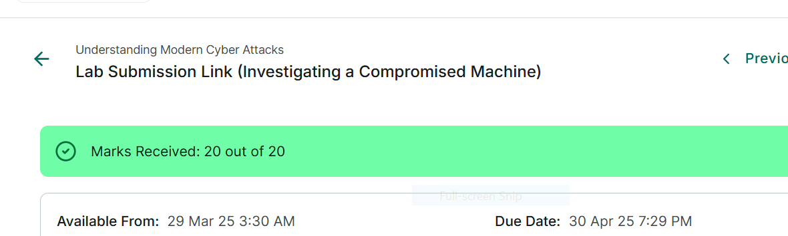

# Windows Compromised Machine Investigation

**Project completed:** 2025  
**Published to GitHub portfolio:** 2026  
**Assessment result:** 20/20

## 🔎 Project Overview

This project demonstrates a hands-on investigation of a compromised Windows machine.

The investigation focused on identifying suspicious SSH communication, examining processes and file activity, reviewing local user accounts and administrative privileges, analyzing failed logon attempts in Windows Event Viewer, and reconstructing a suspicious authentication and audit-log-clearing timeline.

The investigation concluded with an incident summary and recommendations for further analysis.

---

## 🎯 Project Objectives

- Identify the Windows operating system version
- Investigate SSH communication on the compromised host
- Identify the process associated with SSH activity
- Analyze the suspicious executable involved in SSH communication
- Review file hash information
- Examine local user accounts and administrative privileges
- Analyze failed authentication attempts
- Investigate Windows Event Viewer security events
- Identify audit-log-clearing activity
- Reconstruct an incident timeline
- Identify areas for continued investigation

---

## 💻 Compromised Host Information

The investigated Windows machine was running:

**Microsoft Windows 10 Version 1803 — OS Build 17134.2208**

This information established the host environment before deeper investigation.

---

## 🌐 SSH Communication Analysis

The investigation identified SSH communication on:

**Port:** `22`

The process associated with the SSH communication was:

**PID:** `2820`

Further analysis identified:

**Suspicious SSH-related executable:** `sshd.exe`

The investigation also included reviewing hash information associated with the suspicious file.

---

## 👥 Local User Account Analysis

Local user accounts were examined to determine logon activity and administrative privileges.

| User | Last Logon | Administrative Privilege |
|---|---|---|
| Jerry | Never | No |
| Jack | 7/3/2024 4:58:17 AM | Yes |
| John | Never | No |
| James | Never | No |

The account **Jack** was particularly significant because it had administrative privileges and showed suspicious authentication activity.

---

## 🚨 Failed Logon Investigation

Windows Event Viewer was used to investigate failed authentication attempts.

The investigation identified:

**User:** Jack  
**Failed logons:** 5  
**Timestamp:** July 3, 2024 at approximately 4:50:58 AM

These authentication attempts occurred outside the expected working period described in the lab scenario.

---

## 🧹 Audit Log Clearing

Further Windows Event Viewer analysis identified security-log clearing associated with the compromised account.

**User:** Jack  
**Log cleared:** July 3, 2024 at 4:58:40 AM

Clearing audit logs shortly after suspicious access is important because attackers may attempt to remove evidence of their activity and reduce visibility for investigators.

---

## 🕒 Incident Timeline

The investigation reconstructed the following sequence:

1. Multiple failed authentication attempts were associated with the Jack account.
2. Jack's account successfully logged in at approximately **4:58:17 AM**.
3. The account had administrative privileges.
4. SSH-related activity involving `sshd.exe` was identified.
5. At approximately **4:58:40 AM**, the Windows security logs were cleared.

This sequence indicated suspicious account activity requiring further investigation.

---

## 🔍 Investigation Findings

The investigation identified several significant security indicators:

- Multiple failed login attempts
- Successful authentication outside expected working hours
- Unexpected administrative privileges
- SSH communication from the compromised machine
- Suspicious `sshd.exe` activity
- Windows security-log clearing
- Possible attempts to conceal malicious activity

These findings demonstrate the importance of correlating authentication, process, network and Windows Event Log evidence during incident response.

---

## 🧭 Recommended Next Investigation Steps

The next phase of the investigation would examine:

- The exact method used to obtain Jack's credentials
- How administrative privileges were obtained
- The timing of privilege escalation
- Whether additional malicious software was installed or executed
- Activity occurring before the successful compromise
- Other accounts or systems accessed by the attacker
- Evidence of lateral movement across the network

---

## 🛡️ Skills Demonstrated

- Windows Incident Investigation
- Security Event Analysis
- Windows Event Viewer
- Authentication Log Analysis
- Failed Logon Investigation
- Account Privilege Analysis
- SSH Investigation
- Process Identification
- File Hash Analysis
- Incident Timeline Reconstruction
- Audit Log Analysis
- Incident Response
- Threat Investigation
- Security Reporting

---

## 📈 Key Takeaways

This project strengthened my ability to investigate suspicious activity on a Windows endpoint by correlating network communication, processes, user accounts, authentication events and audit-log activity.

The investigation demonstrated how multiple small indicators can be combined to reconstruct a potential compromise and guide the next stage of incident response.

---

## 📸 Project Screenshots

### 1. Windows Host Identification

### 2. SSH Connection and PID Analysis

### 3. Process and Hash Analysis

### 4. User Account and Privilege Analysis

### 5. Failed Logon Event Analysis

### 6. Audit Log Clearing and Incident Timeline

### 7. Assessment Result — 20/20

---

## 📄 Project Evidence

The completed Windows compromised-machine investigation report is included in this repository as supporting evidence.

[📄 View Investigation Report](Investigating%20a%20Compromised%20Machine%20Submission.docx)

The evidence demonstrates Windows host identification, SSH/PID investigation, process and hash analysis, user privilege review, failed-logon analysis, Windows Event Viewer investigation and audit-log-clearing analysis.

**Assessment result:** 20/20

[🏆 View Assessment Result](screenshots/07-compromised-machine-assessment-result-20-of-20.png)

---

## 👨‍💻 Author

**Benard Obi Kekong**

Cybersecurity Analyst | CompTIA Security+ | SOC & GRC | Microsoft Sentinel | SIEM | Risk Assessment | Python
